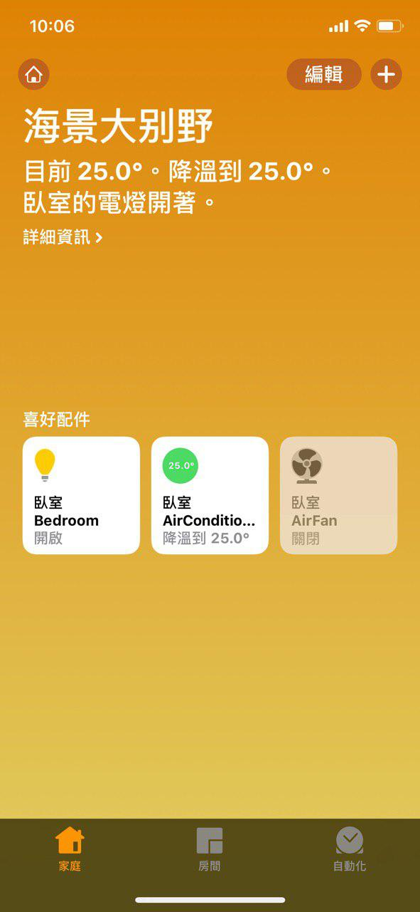
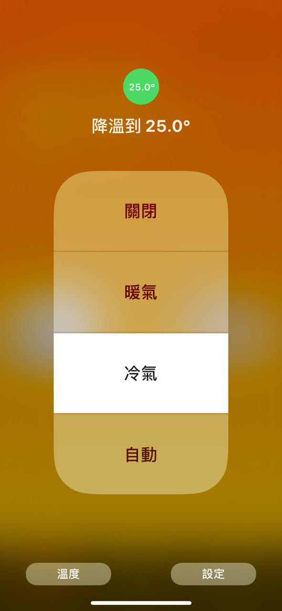
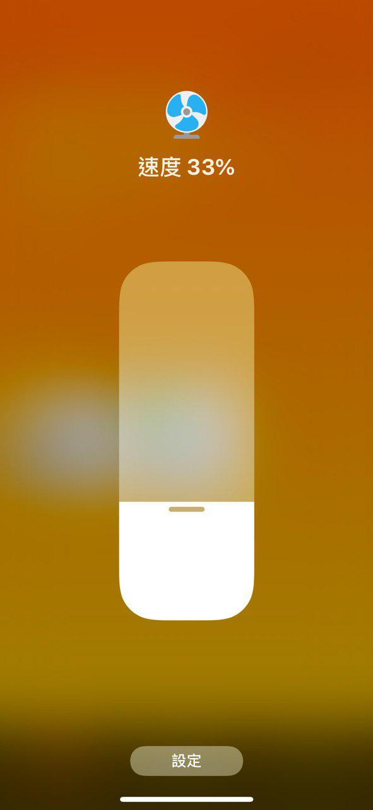

# Homekit Broker for Gree Air Conditioner

Link Homekit to your Gree air conditioner(YB0F2) using Raspberry Pi.

## Features

- Work with Apple Homekit to control Gree air conditioner through IR.
- Turn on air conditioner when changing the target temperature(cooling mode in this case by default).
- Fan speed 1-3 means the real fan speed; 0 means auto speed.

## Setup

1. Configure your Raspberry Pi:
    - Connect IR transmitter to Rpi 17(in BCM).
    - Add `dtoverlay=lirc-rpi,gpio_in_pin=18,gpio_out_pin=17` to `/boot/config.txt`.
    - Install `Lirc` and configure it.

2. Configure Lircd service:
    - Put generated config file `air.lircd.conf` into `/etc/lirc/lircd.conf.d` folder (make sure the file name is with suffix `.conf`).
    - Restart `lirc` with `sudo systemctl restart lircd.service`.

3. Boot the program:
    - Put `ac.conf` into `/etc/supervisor/conf.d` if you use `supervisor`.
    - Connect accessory to Homekit with default pin `23333333`.

## Customize

- Regenerate `lircd` configure file: Use `config-gen.py`.
- Specify pin or storage folder using `AirRC --pin=23333333 --storage=config`.

## Snapshots

